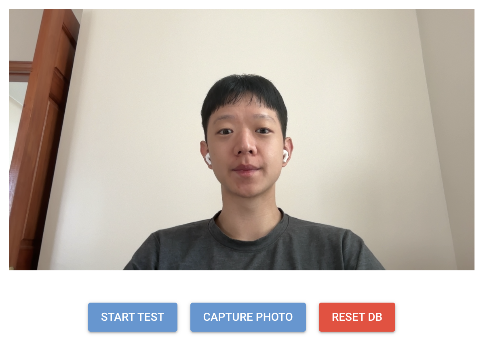
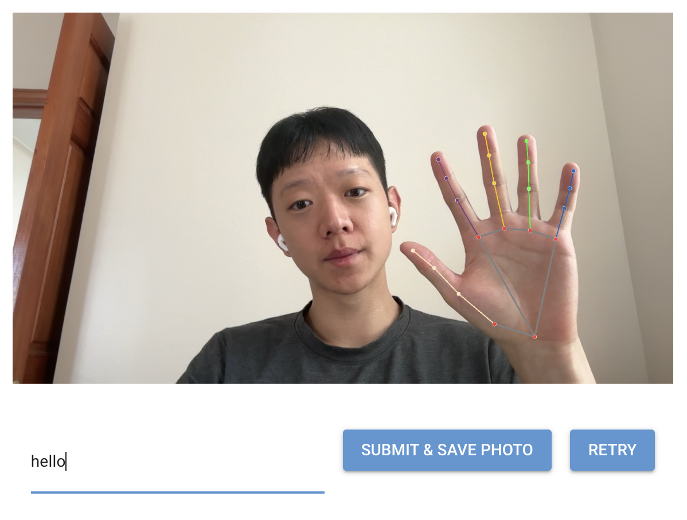
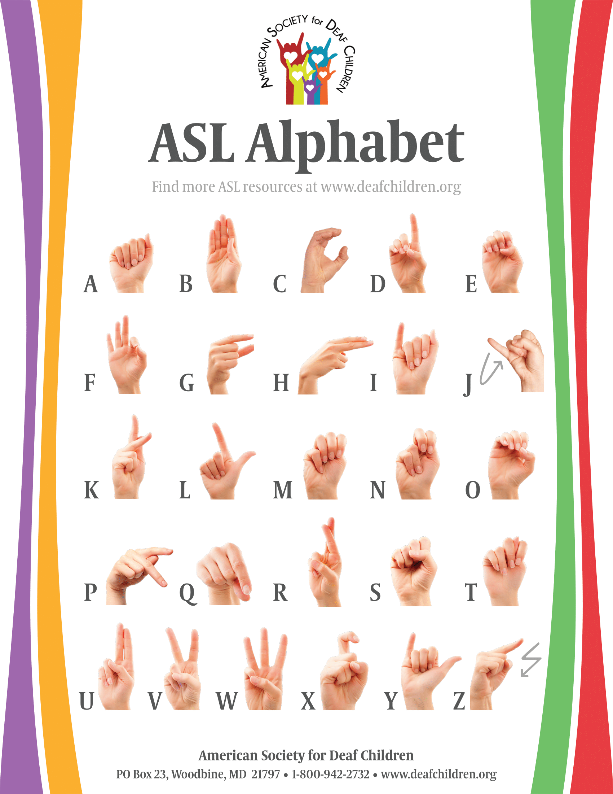
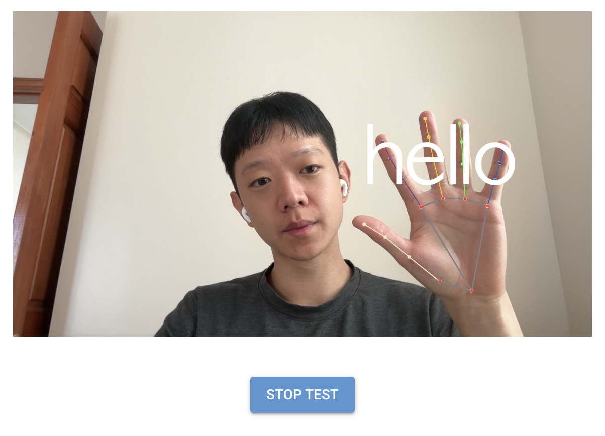

# Hand Sign translator with mediapipe and chromadb

Detects static hand signs from a webcam feed and translates the signs into the nearest label provided to the vector database (chromadb). Add as many single static hand sign variations as you want or even add mulitple variants of the same label.

<p align="center">
  
</p>

### Requirements
- anaconda
- access to webcam 

### Setup Instructions

Clone this repository:

```git clone https://github.com/LwrncLiu/hand_signs.git```

In the `hand_signs/` directory you just cloned, create a conda environment and activate it:

```
conda create -n aslenv python=3.10
conda activate aslenv
```

Install the necessary python packages using pip 

```
pip install -r requirements.txt
```

Run `app.py` to spin up the application
```
python app.py
```

### Navigate the UI
Upon startup, you see the home screen with the webcam feed in the center and three buttons along the bottom: `START TEST`, `CAPTURE PHOTO`, `RESET DB`. 

<p align="center">

</p>

#### `CAPTURE PHOTO`

<p align="center">

</p>

To add hand signs and labels, orient your hand into the desired sign (left or right) in view of the webcam and click `CAPTURE PHOTO`. A preview of the captured photo is shown. Add a label to the captured photo and submit the hand sign to the vector database with `SUBMIT & SAVE PHOTO`. To start off, try signing a few letters from the ASL alphabet.

<p align="center">

</p>


If the captured hand sign is not accurate or no hands were detected in the captured photo, click `RETRY` to return to the home screen.

#### `START TEST`

<p align="center">

</p>

The visible hand's landmarker coordinates are converted to vectors and queried against the chromadb vector database. If a given hand sign's vector representation's euclidean distance is within 0.10 of an existing vector in the vector database, then the label for the existing vector is returned and drawn on the webcam feed. 

To stop testing, simply click the `STOP TEST` button to return to the home screen.

#### `RESET DB`
If you do not like the existing hand signs stored or want to start from scratch clicking `RESET DB` will delete all records in the chromadb collection so that you can start from scratch. 

This button is RED because the effects are irreversible!